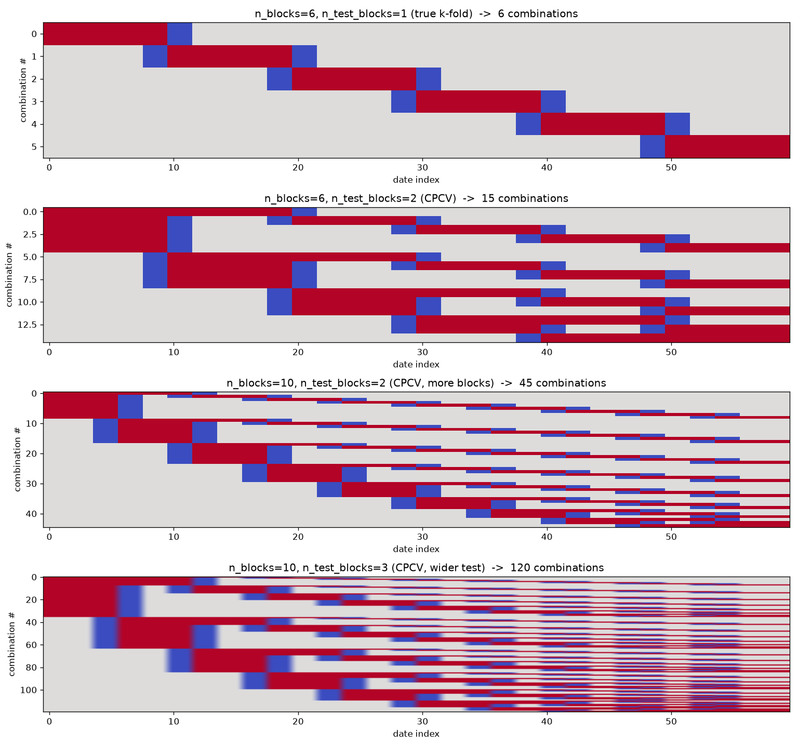
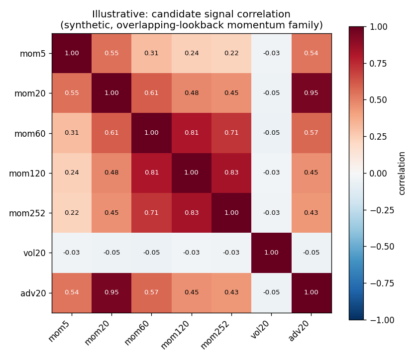

# Methodology notes

Detailed write-ups on the parts of this project worth getting right, not just
implementing: what each method does, the formula, why it's the right tool
here rather than a common alternative, and what its actual failure modes are.
Written to be read back later, not just once. Linked from the main README.

---

## 1. Evaluating a signal properly

### 1.1 Information Coefficient (IC)

The Information Coefficient is the cross-sectional correlation, per date,
between a signal's values and the forward return realized after that date.
It's the main evaluation metric here, not a single backtest's return or
Sharpe ratio, which is far easier to overfit by adjusting almost anything
about how the backtest is constructed.

**Spearman, not Pearson.** IC here always means Spearman rank correlation
("Rank IC"), computed via `pl.corr(signal, fwd_ret, method='spearman')`.
Pearson correlation is sensitive to outliers, a handful of extreme return
days can dominate the whole day's IC value. Spearman only depends on
ranking, which is what actually matters when the signal is used to rank and
select stocks, not predict their exact return magnitude.

`src/evaluation/signals/IC/core.py`: `compute_ic()` returns one IC value per
date. `summarize_ic()` aggregates that series into `mean`, `std`,
`ir = mean/std` (information ratio, the main number for comparing signals),
`hit_rate` (fraction of days with IC > 0), and a naive t-stat.

### 1.2 Naive significance vs Newey-West HAC correction

**The naive t-stat.** `mean / (std / sqrt(n))`, treating each day's IC as an
independent draw. This is the textbook formula, and it's wrong here by
construction: overlapping-window features (`mom20` uses a 20-day window, so
consecutive days' feature values, and therefore consecutive days' IC, are
mechanically correlated) violate the independence assumption the naive
formula needs.

**Newey-West (HAC) correction.** `IC/metrics.py`, `newey_west_ic_tstat()`.
Instead of treating the IC series as independent draws, it estimates the
long-run variance directly, accounting for serial correlation up to a chosen
number of lags:

```
long_run_var = gamma_0 + 2 * sum_{k=1}^{L} (1 - k/(L+1)) * gamma_k
```

where `gamma_k` is the lag-k autocovariance of the demeaned IC series, and
the `(1 - k/(L+1))` weight is the Bartlett kernel, it down-weights higher
lags smoothly rather than cutting them off abruptly. The standard error of
the mean is then `sqrt(long_run_var / n)`, and the t-stat is `mean / se`.
`L`, the max lag, defaults to the Newey-West (1994) rule of thumb,
`4 * (n/100)^(2/9)`, a fixed convention, not tuned per signal.

**Which direction the correction goes is not fixed.** The common intuition
is "overlapping windows mean positive autocorrelation, so NW inflates the
standard error and lowers the t-stat." That's the typical case, but not
guaranteed. NW responds to whatever autocorrelation is actually present, and
that can be negative: a slow-moving feature like `mom252`, whose
cross-sectional ranking barely changes day to day (especially after decile
bucketing), produces an IC series whose day-to-day *variation* comes almost
entirely from the forward-return side, not the signal side. If short-horizon
returns carry mild negative serial correlation (short-term reversal,
bid-ask bounce, or artifacts from `Adj Close` being retroactively restated,
see README's data provenance limitation), that negative correlation
telescopes into the IC series, and a negative `gamma_1` genuinely tightens
the NW standard error relative to the naive one, successive noise partially
cancels. A higher NW t-stat than the naive one is a legitimate result in
that case, not a bug, distinct from a real bug that also produces this
symptom (see next paragraph).

**A distinct historical bug, for context.** An earlier version of
`newey_west_ic_tstat` silently accepted a 2D input (a full `date, ic`
DataFrame instead of the `ic` column alone), which corrupted the mean with
date values cast to float and produced nonsensical, wildly inflated t-stats
(observed: 3.8 naive vs 194 NW, a ratio no realistic autocorrelation
structure can produce, verified by simulation: even an unrealistic
lag-1 autocorrelation of -0.9 over 1250 observations only inflates the
t-stat by about 3.3x). Fixed by validating input shape at the top of the
function (`if x.ndim != 1: raise ValueError(...)`) rather than coercing
silently. Kept here as a reminder: a NW t-stat moving in the "wrong"
direction is worth checking the input shape first, then the actual
autocorrelation, in that order.

### 1.3 Autocorrelation diagnostics

`src/utils/stats.py`, `autocorrelation()`. General-purpose lag-k
autocorrelation, usable on a flat single time series (e.g. a daily IC
series, one row per date) or on a ticker panel (per-group autocorrelation,
aggregated to a cross-group mean and std, since a single "the"
autocorrelation doesn't exist across a panel of different tickers). This is
the direct diagnostic for the NW question above: print `gammas` from
`newey_west_ic_tstat`, or call `autocorrelation(ic_df, 'ic', lags=(1,2,3))`
directly, to see the sign and size of the serial dependence actually driving
a given correction, rather than inferring it indirectly from IC decay
(decay measures the *level* of predictive power at different horizons, a
different question, conflating the two was an earlier mistake in this
project's own reasoning, worth remembering not to repeat).

### 1.4 False discovery rate control

Testing many candidate signals, or many parameter variants of the same
signal, in the same round is a multiple-testing problem. A 5% significance
threshold applied independently to each one produces false positives by
construction. `src/evaluation/signals/fdr.py` implements three approaches,
deliberately kept side by side rather than collapsing to one:

**Benjamini-Hochberg (BH).** Sort p-values ascending, `p_(1) <= p_(2) <=
... <= p_(m)`. Find the largest `k` such that `p_(k) <= alpha * k / m`,
reject (call significant) every hypothesis up to and including that `k`.
Valid under independence or positive regression dependence (PRDS) among the
test statistics.

**Benjamini-Yekutieli (BY).** Identical mechanics, but the threshold is
divided by the harmonic number `H_m = sum_{i=1}^{m} 1/i`:
`p_(k) <= alpha * k / (m * H_m)`. Valid under arbitrary dependence, no PRDS
assumption needed, at the cost of a threshold that shrinks as `H_m` grows
with `m` (roughly 3.6x more conservative than BH at m=20). The right choice
when candidates are correlated, which is the normal case here: different
lookback windows of the same feature, or different transform methods of the
same underlying signal, are built from the same overlapping return history,
so BH's independence/PRDS assumption is questionable. Harvey, Liu & Zhu
(2016, "...and the Cross-Section of Expected Returns", Review of Financial
Studies) use exactly this reasoning for the same problem in finance.

**BH and BY both fix `alpha` before producing an answer**, and both
implicitly assume the worst case, that every single candidate could be a
true null (`pi0 = 1`), which is exactly why they're conservative even when
most candidates are obviously real signals.

**Storey's q-value.** Flips the question: instead of "is this significant
at a chosen alpha," it asks "if this p-value were used as the cutoff, what
FDR would that produce?" That minimum achievable FDR, per candidate, is its
q-value, the FDR analogue of a p-value. In other words: It's the smallest 
false-discovery-rate level at which that specific test would still be called significant. 

Two differences from BH/BY:

- `pi0` (the true proportion of null candidates) is *estimated* from the
  data instead of assumed to be 1. Genuine null p-values are uniform on
  [0,1]; genuine signals pile up near 0. Looking at the right tail of the
  p-value distribution (p-values near 1, where real signals essentially
  never land) estimates what fraction is pure noise. Implementation:
  compute `pi0_hat(lambda) = mean(p > lambda) / (1 - lambda)` across a
  fixed grid of `lambda` values (a standard, dataset-independent grid, not
  tuned per batch), fit a cubic smoothing spline across the grid, evaluate
  at the right edge. This is the estimator itself, no alpha involved.
- q-values need no `alpha` to compute. Every candidate gets a number,
  monotonically enforced via a backward pass,
  `q_(i) = min(pi0 * m * p_(i) / i, q_(i+1))`, starting from
  `q_(m) = pi0 * p_(m)`. Any cutoff applied afterward is a visibly separate
  decision from the significance computation itself.

Net effect: when `pi0 < 1` (expected whenever a batch actually contains real
signals, not pure noise), q-values are strictly more powerful than BH/BY at
the same nominal FDR, because they aren't spending budget pretending
everything might be null. The cost is one extra estimation step BH/BY don't
need. This is preferred going forward per this project's no-free-parameters
principle (see README, "Design philosophy"): BH/BY require a human-chosen
`alpha` to produce any output at all; q-values don't.

Choosing `alpha`: the famous low signal-to-noise ratio translates to little
to none signals selected with an `alpha` of 0.05 or lower. This means we lose 
real-but-weak candidate signals. We therefore allow `alpha` to be bigger, 
for now set at `0.2`.

*Reading a q-value, concretely.* Test 10 candidate signals, sorted
p-values `0.001, 0.004, 0.006, 0.01, 0.02, 0.03, 0.05, 0.08, 0.10, 0.5`, and
suppose the data suggests about half this batch is genuinely null
(`pi0 = 0.5`). The resulting q-values: `0.005, 0.01, 0.01, 0.0125, 0.02,
0.025, 0.036, 0.05, 0.056, 0.25`.

Read the 3rd one: q=0.01 means "if I declared the 3 smallest p-values
significant, I'd expect 1% of that set of 3 to be false discoveries." Not
"this single signal has a 1% chance of being false", that's not what any
p-value-derived number means, it's a statement about the batch you get if
you drew the line at this candidate's rank.

Notice p and q move in different directions relative to each other: the
smallest p-value (0.001) gets a *larger* q (0.005), penalized for having
been tested alongside 9 other candidates. The largest p-value (0.5) gets a
*smaller* q (0.25) than its own p, because `pi0=0.5` means the procedure
isn't assuming, the way BH's threshold implicitly does, that every last
candidate might be null.

Which number to trust when reporting one figure per signal: the q-value.
A p-value in isolation says nothing about how many other candidates were
tested alongside it, quoting it alone silently implies it's the only test
run, which it never is here. The q-value carries that context built in.

**FDR choice: continuous prior, not a hard gate.** `fdr_report()` computes BH, BY, and q-value side by side, but none of `survives_bh` / `survives_by` is used as a hard filter into the signal combiner. Two reasons. First, a hard cutoff at any `alpha` throws away graded information, a candidate just above and just below the line are treated as categorically different despite being nearly identical in strength. Second, using a cutoff would introduce a second free parameter beyond `alpha` itself, which q-value would need (some chosen q-threshold), reproducing exactly the "picked because it looks right" problem this project's FDR module was built to avoid. Instead, the q-value feeds into the combiner as a continuous weight, letting the combiner's own regularization (see Section 5, Elastic Net) do the actual inclusion/exclusion, informed by evidence strength rather than a binary pass/fail upstream of it.

### 1.5 IC decay across forward-return horizons

`ic_decay()`, Rank IC of a signal against forward returns at several
horizons (1, 5, 10, 20 days by default). Shows how long predictive power
actually persists, which directly informs a sensible rebalance frequency: a
signal with IC only at horizon 1 wants daily rebalancing (expensive), one
that holds to horizon 20 can rebalance far less often. Depends entirely on
forward returns being computed correctly as the *cumulative* return over the
horizon, `log(P_{t+h}/P_t) = sum_{k=1}^{h} logret_{t+k}`, not the single
day's return h days out, an earlier bug (`shift(-h)` instead of
`rolling_sum(h).shift(-h)`) computed the latter, which produces a decay
curve that looks artificially flat because every horizon was really
measuring close to the same 1-day relationship at different offsets.

### 1.6 Walk-forward, purged, embargoed cross-validation

Embargo adds a small gap after the test period before the next fold's training starts. Unlike in true K-fold (Section 1.7), this isn't protecting any single fold's own validity, purge alone already does that here, since train is always strictly before test in walk-forward. It's protecting the independence of results across folds when they get aggregated into one statistic (e.g. `ElasticNetCV` validation score across folds to pick `alpha`), without it, two folds whose train/test boundaries sit close together could give correlated rather than independent-ish OOS readings, understating how uncertain the aggregate really is. 
Reference: López de Prado, *Advances in Financial Machine Learning*.

We start constructing the folds from the latest date available, and go backwards from there. 
That is to take full advantage of the "freshest" data, especially with the survivorship bias
currently present, responsible for less data at the start of our dataset. 

We added the `next_fold` argument to the function, to choose when to start the next fold, 
either directly after the last `test_set` using `consecutive` argument, or give an `int` to 
set the number of dates between one `train_set` and the next. 

Recent literature (Arian et al. 2024) states plain walk-forward remains the industry standard for realistic simulation, 
combinatorial purged CV is better at mitigating overfitting specifically when you're doing model/hyperparameter search 
across many trials (relevant later for elastic net alpha/l1_ratio and the GBM comparison, not for basic signal evaluation now)

### 1.7 True purged-embargoed K-fold and CPCV 

Distinct from the walk-forward scheme above, not a replacement for it. Walk-forward keeps train strictly before test, realistic for simulating actual deployment, but only produces a handful of folds given the history available. True K-fold allows train to include data from both sides of a test block chronologically, which means embargo becomes necessary for a single fold's own validity here (not just for cross-fold independence, as in the walk-forward case, see splits.py's docstring), following López de Prado (2018), ch. 7. CPCV (purged_embargoed_kfold_splits with n_test_groups > 1) extends this combinatorially, evaluating every combination of held-out groups. Full AFML path reconstruction (ch. 12) is not implemented, not needed for the specific statistic used here (see below).



Grey = train, red = test, blue = purge/embargo excluded. Fold count matches `C(n_blocks, n_test_blocks)` exactly in every setting shown (6, 15, 45, 120). Test blocks widen and multiply together as `n_test_blocks` grows, more combinatorial coverage, but each individual combination covers a wider, less granular slice, a real tradeoff, visible directly here rather than just asserted in prose.

**Tuning the embargo window, two separate components, combined explicitly, not silently:**

1. **Structural minimum, `horizon + 1`.** The test set's own forward-return label reaches `horizon+1` days past `test_end` (per the open-to-open execution lag in `returns.py`). A training row placed any closer than that has a label window overlapping the test label's own construction, sharing raw daily returns even though neither row's features touch the other's data. Fixed, known in advance, no estimation needed.
2. **Empirical component, from `scripts/embargo_selection.py`.** Tests lag-wise autocorrelation of market returns, FDR-corrected across all tested lags (`alpha=0.05`, distinct from the FDR module's own `0.2`, chosen independently, not reused by habit). Final choice: `largest_surviving_lag` under BY correction, not the gentler `first_contiguous_run` alternative, deliberate: any lag with a genuinely FDR-validated correlation, however far out, is a channel a training row could still "see" information through, worth protecting against even if it's more likely a distinct periodic effect than boundary decay. Current result: **16** (BY), driven partly by strong lag-1 reversal (well-documented nonsynchronous-trading effect, Lo & MacKinlay, 1990) and partly by isolated dependence further out (see `docs/findings.md`, not yet explained).

The two combine via `sum` (`src/validation/cpcv.py`, `total_embargo_window()`), matching the convention in López de Prado (2018): purge + embargo as the total buffer around a test block, `max()` is available as an alternative if the two risks are believed not to compound, not the project's chosen default. For `horizon=20`: `total_embargo = (20+1) + 16 = 37`. Recompute the empirical component whenever the market's own behavior might have changed, or when the forecasting horizon changes meaningfully, rerun on the horizon-matched, market-aggregated forward return (not daily `logret`) to check for real dependence beyond what pure overlap in the label construction already explains structurally.

**Probability of Backtest Overfitting:** `probability_of_backtest_overfitting()` implements the CSCV algorithm from Bailey, Borwein, López de Prado & Zhu (2017, Journal of Computational Finance 20(4), 39-69): given a performance matrix across several candidate strategies/configurations, repeatedly split into in-sample/out-of-sample halves, check whether the in-sample winner still ranks above the OOS median, PBO is the fraction of splits where it doesn't. Requires at least two real candidates to compare, not used to evaluate a single model in isolation, see Section 5 for the concrete GBM vs. Elastic Net application.

---

## 2. Turning a feature into a signal

A raw feature (`mom20`) isn't directly usable to rank stocks against each
other, different tickers live on different scales. Needs a cross-sectional
transform first, per date, across all tickers. `src/signals/combine.py`,
`make_signal()`.

### 2.1 Z-score, then bound the tails

Standardize within each date: subtract the cross-sectional mean, divide by
the cross-sectional std. Preserves relative magnitude, a stock two standard
deviations above average looks meaningfully different from one five above.
Unbounded by construction, needs a follow-up step:

- **Hard clip** (`clip(-3, 3)`), simple, standard default, discontinuous at
  the boundary.
- **tanh**, smooth alternative, near-linear close to 0, saturates past
  roughly `|x| = 3`. Preferred when the clip's discontinuity feels wrong.

### 2.2 Rank transform

Rank the feature within each date, rescale to `[-1, 1]`. Bounded and
outlier-proof by construction, since it only uses ordinal position, no
separate clipping step needed. Trade-off: discards magnitude, a stock ranked
#1 and #2 are treated as equally far apart as #50 and #51, even if their raw
values differ wildly.

### 2.3 Decile / quantile bucketing

Split the cross-section into buckets, assign a bucket label instead of a
continuous score. Coarser than either of the above, but this is the
standard way academic factor papers report results (long top decile, short
bottom decile), useful as an easy baseline to benchmark a continuous signal
against.

### 2.4 Which one fits which feature

- Well-behaved, already-validated features (`mom`, `adv`, `std`): z-score +
  tanh by default. Magnitude is trustworthy, worth keeping.
- Features not fully trusted yet (`beta`, until the market-proxy fix
  lands): rank transform, robust to whatever extreme values the underlying
  computation still produces.
- A simple, explainable baseline, or comparison against an academic
  long/short factor result: decile bucketing.

Not mutually exclusive across the project, different features can use
different methods. Not usually worth stacking two on the same feature.

---

## 3. Combining signals: the Elastic Net combiner

`src/models/elastic_net_combiner.py`. Takes the survivors of `signal_report()` + `fdr_report()`, combines them into a single predictive score via Elastic Net regression against forward returns, with `alpha`/`l1_ratio` chosen through this project's own leakage-safe CV (Section 1.6/1.7), not sklearn's default random k-fold, which would silently reintroduce exactly the leakage the CV module exists to prevent.

**Why Elastic Net, not Lasso or Ridge alone.** Candidate signals are correlated by construction, `mom20`/`mom60`/`mom252` share overlapping return history. Pure Lasso handles correlated groups badly, tends to arbitrarily keep one member of a correlated group and zero the rest, unstable across resamples (Zou & Hastie, 2005, JRSS B, 67(2), 301-320, their own framing: "if predictors are correlated, lasso arbitrarily selects one"). Ridge keeps everything, never zeros anything, no sparsity, harder to say which signals actually survived combination. Elastic Net's L1+L2 mix is the standard answer to exactly this setup.



Synthetic, not yet real candidate signals (none of the actual `mom`/`vol`/`adv` family has been jointly correlation-checked yet), illustrating the structural point: overlapping-lookback momentum signals (`mom5` through `mom252`) correlate strongly with each other (0.22-0.83) purely from shared return history, while an unrelated signal (`vol20` here) stays near-independent, the contrast that motivates Elastic Net over Lasso. Replace with the real correlation matrix once enough signals pass Section 1.4's FDR screen to make the comparison meaningful.

**q-value as a continuous penalty weight, not a hard filter.** `apply_q_value_weighting()`. Per Section 1.4's design decision (continuous prior, not a hard gate), a candidate's q-value needs to influence the combiner without ever being used as a survives/doesn't-survive cutoff. sklearn's `ElasticNet.fit(sample_weight=)` weights *rows* (observations), q-value is a property of a *column* (a candidate signal), these aren't interchangeable. The mechanism used instead: rescale each signal's column by `(1 - q)` before fitting. Elastic Net's penalty acts uniformly on coefficient magnitude, so shrinking a low-quality signal's raw input values means a larger true coefficient is needed to contribute the same amount to the prediction, an implicit differential penalty without a second regularization parameter to tune. Same idea as Zou's Adaptive Lasso (2006, JASA 101(476), 1418-1429), per-feature penalty weights, theoretical grounding, not an ad hoc trick: the adaptive lasso objective is `[prediction error] + lambda * sum_j w_j |beta_j|`, a higher `w_j` pushing `beta_j` toward zero more easily, exactly what `(1-q)` rescaling achieves indirectly through the input scale rather than an explicit per-coefficient weight. Open question, not resolved: whether a linear `(1-q)` rescale is the right transform versus `sqrt(1-q)` (gentler) or `(1-q)^2` (harsher), no literature-mandated answer, whichever is used should be a stated convention decided before seeing which signals it favors.

**Pooled panel, not Fama-MacBeth.** `build_design_matrix()` pools every `(date, ticker)` row across a fold's history into one design matrix, rather than fitting a separate cross-sectional regression per date and averaging the resulting coefficients (the classic Fama-MacBeth, 1973, two-step procedure). Fama-MacBeth exists primarily as an *inference* tool, testing whether a characteristic's average risk premium is significantly different from zero over time, accounting for cross-sectional correlation of residuals within a date, largely the same question Section 1.2's Newey-West correction and Section 1.4's FDR machinery already answer here, applied to individual candidate signals before they ever reach the combiner. What's needed at the combiner stage is different: an optimally-regularized *predictive* combination for deployment, which is what pooled Elastic Net directly targets. A pooled fit also solves a practical problem Fama-MacBeth would reintroduce, a single date's cross-section is only around 500 names, too thin to fit several correlated signals against stably, pooling across a fold's ~800 trading days gives tens of thousands of rows instead. Genuine open question for later, once there's a working combiner: how its risk-adjusted performance holds up over calendar time (recent years vs. older, or across CPCV blocks) is a more directly actionable question than how its fitted coefficients evolve, worth investigating first, coefficient evolution second if the first raises specific concerns.

**Missing-data policy, explicit, not implicit.** `build_design_matrix()` drops a `(date, ticker)` *row* if *any* of its candidate signal columns is null, all-or-nothing per row, not a blanket drop of any signal project-wide. Real cost: candidate signals have different lookback windows (`mom20` needs 20 days, `mom252` needs 252), so including a long-lookback signal disproportionately drops early-history and recently-listed tickers, interacting with the survivorship-bias caveat already documented in the README. The alternative, cross-sectional per-date median imputation, replaces a missing signal value for one ticker with that date's median across all *other* tickers rather than dropping the row. Since signals are already cross-sectionally normalized (z-scored/ranked, see Section 2) before reaching the combiner, the cross-sectional median of a normalized signal sits close to zero, so imputing with it effectively says "unknown tilt on this signal, treat as neither long nor short conviction on it" for that one ticker, while keeping the row's *other* signals and its forward-return label as usable training data. Current default is drop, not imputation, not yet tested against the musée des horreurs fixtures, worth doing before trusting either policy in production.

**Nested CPCV search + untouched final holdout, current gap.** `fit_elastic_net_combiner()`, as currently wired, only uses the walk-forward scheme (Section 1.6) via `build_row_index_folds()`, `'consecutive'` mode. `scripts/en_cpcv_demo.py` and `scripts/compare_gbm_vs_en_pbo.py` demonstrate a more rigorous nested design instead: tune `alpha`/`l1_ratio` via CPCV (Section 1.7, more folds, more robust against the search itself overfitting one historical path), then sanity-check the fixed, already-chosen model on a genuinely untouched final holdout, never seen during the CPCV search, evaluated the causally-realistic, walk-forward-style way. That nested design exists and has been tested (both scripts run end to end), it just hasn't been folded back into `fit_elastic_net_combiner()` as the default yet, worth doing once the design is settled rather than maintaining two divergent code paths.

---

## 4. Comparing model families: GBM vs. Elastic Net via PBO

Once more than one finished combiner exists, comparing them by headline
IC alone risks mistaking noise for a genuine difference. Probability of
Backtest Overfitting (Bailey, Borwein, Lopez de Prado & Zhu, 2017,
*Journal of Computational Finance* 20(4), 39-69) answers a different,
more useful question: if you picked whichever candidate looked best on
some slice of history, how often would that pick actually hold up on a
different slice? Implemented in `probability_of_backtest_overfitting()`
(`src/validation/cpcv.py`), consumed by `scripts/compare_gbm_vs_en_pbo.py`.

Both candidates are tuned via CPCV on an identical search region using
IDENTICAL folds (fairness: neither gets an easier or harder split by
chance), then evaluated, fixed, on a shared, genuinely untouched holdout,
split into contiguous sub-blocks for the PBO matrix. This is a scoped-down
adaptation of full CSCV (see the script's docstring for exactly what's
simplified and why), not the textbook nested-refit version, upgrade path
noted there if this becomes a recurring comparison rather than a one-off.

GBM (`src/models/gbm_combiner.py`, `HistGradientBoostingRegressor`) is
the natural nonlinear counterpoint to Elastic Net: if it meaningfully
outperforms, that's evidence of real interaction effects between
candidate signals a linear model can't express. If not, per Friedman
(2001), more flexible function classes only pay off if the true
relationship has that shape, otherwise they mostly add variance, and PBO
should reflect that as a high, unreliable-selection number rather than a
confident model preference. See `docs/findings.md` for two sanity checks:
a synthetic linear relationship (correctly high PBO, no real difference
to detect) and a synthetic interaction relationship (correctly low PBO,
GBM genuinely and detectably better there).

---

## 5. Correlation structure and portfolio construction

Two genuinely separate questions get asked about the same correlation
matrix, kept as separate functions on purpose, never chained
automatically under the hood:

### 5.1 Cleaning the correlation matrix (RMT / Marchenko-Pastur)

`src/risk/correlation_cleaning.py`. An empirical
correlation matrix over hundreds of tickers is mostly noise. Random Matrix
Theory gives a theoretical eigenvalue range (Marchenko-Pastur) expected from
a pure-noise correlation matrix, given the assets-to-observations ratio
`q = n_assets / n_obs`. Eigenvalues inside that range get shrunk or
replaced (commonly with their average, to preserve the trace), only
eigenvalues above the range are treated as genuine common-factor structure.
Answers: "how much of this correlation matrix is real." Only the upper MP
bound (`lambda_max`) is used, not the lower one, financial correlation
matrices are positive semi-definite by construction, MP's theoretical
lower bound can dip below zero for large `q`, not a real constraint here.
Reference: Laloux, Cizeau, Bouchaud, Potters (1999).

Validated on synthetic data with known structure before trusting on real
signals: 3 planted clusters (sizes 15/10/8) buried in 12 pure-noise
tickers, `n_obs=500`. Result: exactly 3 eigenvalues land above `lambda_max`,
with a real gap between the 3rd (3.39) and 4th (1.27, right at the noise
boundary 1.69), trace preserved exactly (45.0 -> 45.0) after cleaning.

### 5.2 Community detection (Louvain)

`src/evaluation/portfolio/clustering/louvain.py` (header comment notes
intended future path `src/risk/clustering.py`, not yet moved). Groups
tickers into clusters that maximize modularity on the correlation graph.
Answers a different question from RMT cleaning: "which stocks move
together," not "how much of the correlation structure is real." Louvain
over k-means deliberately, no `k` to choose in advance, the number of
clusters falls out of the modularity-maximization itself, consistent with
this project's no-free-parameters preference (README, "Design
philosophy"). Operates on whatever matrix it's given, raw or RMT-cleaned;
chaining the two is a separate, explicit orchestration step, not
automatic inside `louvain_clustering()` itself, so cleaning is never
silently applied or silently skipped. Reference: Blondel et al. (2008),
"Fast unfolding of communities in large networks."

**Edge-weight convention, a real decision, not mechanical.** Only
positive correlations become graph edges, negative correlations are
dropped entirely rather than taken as `|corr|`. Purpose here is grouping
tickers that move together so a downstream risk step can avoid stacking
correlated exposures in one cluster. Two tickers with correlation -0.8
are the *opposite* of a diversification risk, holding both reduces
portfolio variance, treating them as "belonging together" via absolute
value would be actively wrong for this purpose, not a rounding choice.

Validated on the same synthetic 3-cluster panel used above: Louvain
recovers all three planted clusters with perfect membership, no mixing,
run on the RMT-cleaned correlation matrix from Section 5.1.

Kritzman & Li's **Absorption Ratio** (`absorption_ratio.py`, not yet
implemented, currently misplaced under `src/evaluation/signals/`, header
comment notes intended path `src/risk/covariance_cleaning.py`), share of
total variance explained by the top few eigenvalues, is a related but
distinct diagnostic: a rising ratio means the correlation structure is
collapsing onto fewer common factors, historically associated with
periods preceding market stress. A rolling summary statistic, not a
clustering or cleaning method.

### 5.3 From combined score to risk-adjusted weights

`src/risk/portfolio_construction.py`. Chains the two pieces above into
actual position weights, consuming the combined score from Section 3 or
4. Operates on one cross-section (one date) given precomputed inputs,
deliberately: how often to re-estimate the correlation matrix and
re-cluster (daily? weekly? what trailing window?) belongs to the future
backtest loop, not to this module, kept separate so each piece is
testable in isolation.

**Score to raw weight.** `raw_weights_from_score()`: proportional,
dollar-neutral, gross-normalized (`weight_i = score_i / sum(|score_j|)`
per date), not decile-bucketed. A decile long-short needs a bucket-count
parameter with no data-driven justification; proportional weighting uses
the score's own continuous magnitude directly, no cutoff to defend.
Real tradeoff: likely higher turnover than decile buckets, since every
score wiggle moves every weight a little rather than only weights
crossing a bucket boundary, not measured yet.

**Cluster exposure caps.** `apply_cluster_caps()`: caps each cluster's
total absolute exposure at `max_cluster_multiple` times its equal share,
default 2.0, a stated, non-data-derived convention, no parameter-free
version of "how concentrated is too concentrated" exists. **Verified
behavior, not just asserted:** this caps a cluster's exposure relative to
the *original* total gross, it does not redistribute freed-up capacity
into other names or renormalize gross back to its prior level. A capped
cluster's *share* of the final (now smaller) total can end up well above
the nominal `max_cluster_multiple/n_clusters` fraction, tested directly:
a cluster capped to an absolute 66.7% ended up at 93% of the shrunken
total, correct arithmetic, unintuitive without knowing this. An iterative
redistribution scheme would give the more intuitive "no cluster exceeds
X% of the final portfolio" guarantee, not implemented, real added
complexity, revisit once a backtest shows whether the simpler version is
actually binding often enough to matter.

**Vol targeting.** `apply_vol_target()`: scales weights uniformly so
`sqrt(w' Sigma w) == target_vol`. Applied *after* cluster capping, on
purpose, targeting the vol of the portfolio actually held, not a pre-cap
one no longer in use. `Sigma` built from the RMT-cleaned correlation
(Section 5.1), not raw, a covariance built from a noisy correlation
matrix would reinherit exactly the spurious off-diagonal terms cleaning
exists to remove.

**Scope boundary, explicit:** drawdown constraints are not implemented
here. Vol targeting and cluster caps are cross-sectional, a function of
one date's data. Drawdown constraints are path-dependent, a function of
the realized trailing P&L sequence, they need the backtest loop's actual
running state, not a single date's correlation matrix and scores. Belongs
in the future backtest loop, a genuine scope boundary, not a gap here.

---

## 6. Evaluating a new signal: the fixed checklist

Run in this order, every time, before a signal is trusted for anything
downstream:

1. Build it with `make_signal()`.
2. `signal_plots.one_pager()`, visual check: coverage, per-date mean/std,
   ticker x date heatmap, sample ticker lines. Catches structural bugs
   before anything else does.
3. `report.signal_report()`, numeric check: IC mean/std/IR, Newey-West
   corrected t-stat, hit rate, stability, naive long-short paper Sharpe.
4. `IC/metrics.py`'s `ic_decay()`, how far out predictive power actually
   holds, informs rebalance frequency.
5. `report.compare_reports()` against other candidates, side by side.
6. `fdr.py`'s `fdr_report()` across everything tested this round: BH, BY,
   and q-value reported together, no single verdict picked automatically.
7. Survivors move to the signal combiner.

(EDIT)
Use `scripts/inspect_signal.py` to compare signals or inspect a unique signal.
TODO: Add FDR report in `inspect_signal.py` when comparing signals, and IC_decay?


## References

Bailey, D. H., Borwein, J. M., López de Prado, M., & Zhu, Q. J. (2017).
The probability of backtest overfitting. Journal of Computational
Finance, 20(4), 39-69.

Blondel, V. D., Guillaume, J.-L., Lambiotte, R., & Lefebvre, E. (2008).
Fast unfolding of communities in large networks. Journal of Statistical
Mechanics: Theory and Experiment, 2008(10), P10008.

Fama, E. F., & MacBeth, J. D. (1973). Risk, return, and equilibrium:
Empirical tests. Journal of Political Economy, 81(3), 607-636.

Friedman, J. H. (2001). Greedy function approximation: A gradient
boosting machine. Annals of Statistics, 29(5), 1189-1232.

Grinold, R. C., & Kahn, R. N. (2000). Active Portfolio Management (2nd
ed.). McGraw-Hill.

Harvey, C. R., Liu, Y., & Zhu, H. (2016). ...and the cross-section of
expected returns. Review of Financial Studies, 29(1), 5-68.

Jegadeesh, N. (1990). Evidence of predictable behavior of security
returns. Journal of Finance, 45(3), 881-898.

Jegadeesh, N., & Titman, S. (1993). Returns to buying winners and selling
losers: Implications for stock market efficiency. Journal of Finance,
48(1), 65-91.

Kritzman, M., & Li, Y. (2010). Skulls, financial turbulence, and risk
management. Financial Analysts Journal, 66(5), 30-41.

Laloux, L., Cizeau, P., Bouchaud, J.-P., & Potters, M. (1999). Noise
dressing of financial correlation matrices. Physical Review Letters,
83(7), 1467.

Lo, A. W., & MacKinlay, A. C. (1990). An econometric analysis of
non-synchronous trading. Journal of Econometrics, 45(1-2), 181-211.

López de Prado, M. (2018). Advances in Financial Machine Learning. Wiley.

Newey, W. K., & West, K. D. (1987). A simple, positive semi-definite,
heteroskedasticity and autocorrelation consistent covariance matrix.
Econometrica, 55(3), 703-708.

Newey, W. K., & West, K. D. (1994). Automatic lag selection in covariance
matrix estimation. Review of Economic Studies, 61(4), 631-653.

Storey, J. D. (2002). A direct approach to false discovery rates. Journal
of the Royal Statistical Society: Series B, 64(3), 479-498.

Zou, H. (2006). The adaptive lasso and its oracle properties. Journal of
the American Statistical Association, 101(476), 1418-1429.

Zou, H., & Hastie, T. (2005). Regularization and variable selection via
the elastic net. Journal of the Royal Statistical Society: Series B,
67(2), 301-320.